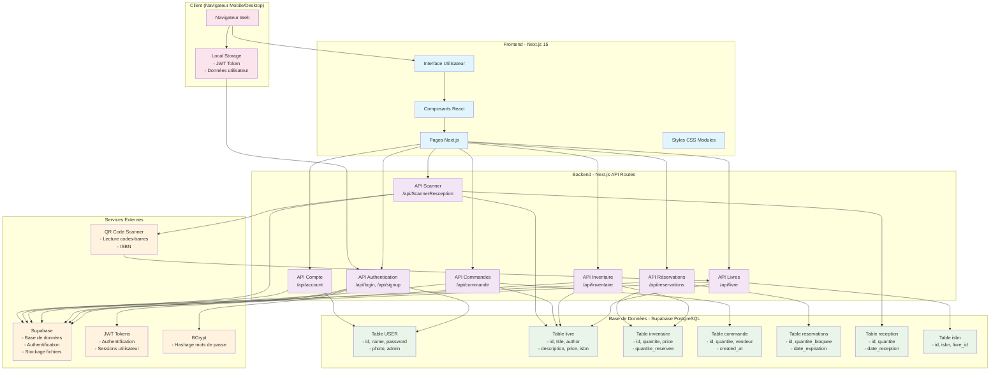

# Diagramme d'Architecture - Application CPH France IOI

## Vue d'ensemble de l'Architecture

Ce diagramme illustre l'architecture complète de l'application de gestion de librairie CPH France IOI, montrant les interactions entre les composants frontend, backend, base de données et services externes.



## Description des Composants

### 🎨 Frontend (Next.js 15)
- **Interface Utilisateur** : Interface responsive optimisée pour mobile
- **Composants React** : Composants réutilisables (LoginForm, Inventaire, Scanner, etc.)
- **Pages Next.js** : Pages de l'application (acceuil, inventaire, commande, etc.)
- **Styles CSS Modules** : Styling modulaire avec Mantine UI

### ⚙️ Backend (Next.js API Routes)
- **API Authentication** : Gestion des connexions et inscriptions
- **API Livres** : CRUD des livres, gestion ISBN
- **API Inventaire** : Gestion des stocks et quantités
- **API Commandes** : Historique des ventes
- **API Réservations** : Gestion des réservations clients
- **API Scanner** : Réception de livres via QR code
- **API Compte** : Gestion des profils utilisateurs

### 🗄️ Base de Données (Supabase PostgreSQL)
- **Table USER** : Utilisateurs et administrateurs
- **Table livre** : Catalogue principal des livres
- **Table inventaire** : Stocks physiques
- **Table commande** : Historique des ventes
- **Table reservations** : Réservations actives
- **Table reception** : Historique des réceptions
- **Table isbn** : Gestion des ISBN multiples

### 🔧 Services Externes
- **Supabase** : Base de données PostgreSQL hébergée
- **JWT** : Authentification par tokens
- **BCrypt** : Sécurisation des mots de passe
- **QR Scanner** : Lecture des codes-barres ISBN

## Flux de Données Principaux

### 1. Authentification
```
Client → API Login → Supabase → JWT Token → Local Storage
```

### 2. Gestion des Livres
```
Scanner QR → API Scanner → Supabase → Table reception → Table inventaire
```

### 3. Consultation Inventaire
```
Client → API Inventaire → Supabase → Tables inventaire/livre → Interface
```

### 4. Gestion des Commandes
```
Client → API Commandes → Supabase → Table commande → Confirmation
```

## Technologies Utilisées

- **Frontend** : Next.js 15, React 19, TypeScript, Mantine UI
- **Backend** : Next.js API Routes, Node.js
- **Base de données** : Supabase (PostgreSQL)
- **Authentification** : JWT, BCrypt
- **Scanner** : React QR Scanner, ZXing
- **Déploiement** : Vercel

## Sécurité

- Mots de passe hashés avec BCrypt
- Authentification JWT avec expiration (2h)
- Validation des données côté API
- Gestion des erreurs centralisée
- Protection des routes sensibles

## Scalabilité

- Architecture modulaire avec composants réutilisables
- API RESTful pour faciliter l'extension
- Base de données relationnelle normalisée
- Support mobile-first responsive
- Gestion d'état local optimisée
