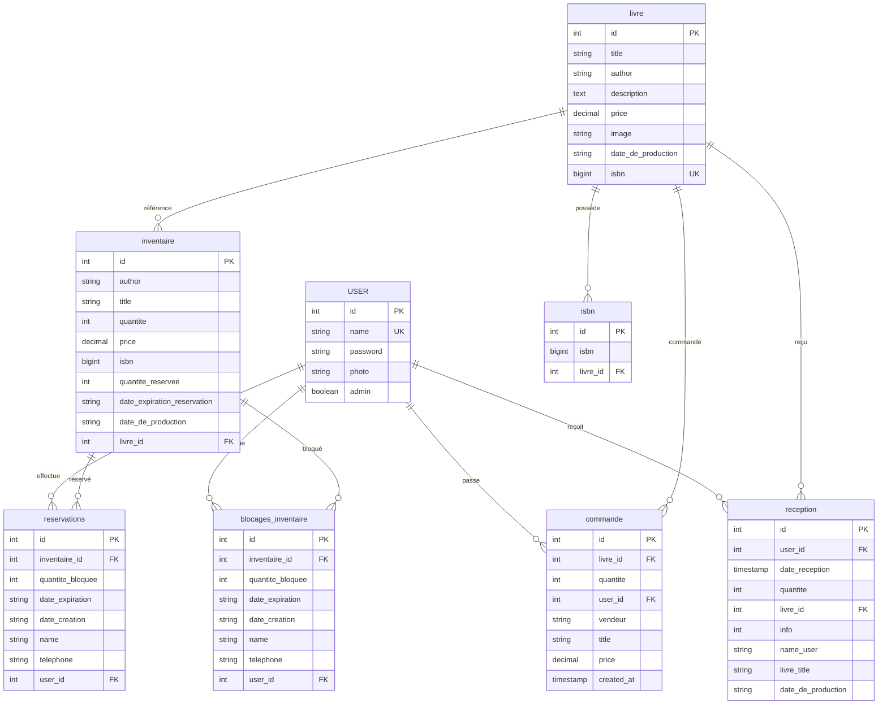

# Schéma UML Base de Données - Application CPH France IOI

## Vue d'ensemble des Tables

Le système de gestion de librairie comprend les tables suivantes :

## Description Détaillée des Tables

### 1. Table USER
**Objectif :** Gestion des utilisateurs du système
- `id` : Identifiant unique auto-incrémenté
- `name` : Nom d'utilisateur (unique)
- `password` : Mot de passe hashé (bcrypt)
- `photo` : URL ou chemin vers la photo de profil
- `admin` : Indicateur de privilèges administrateur

### 2. Table livre
**Objectif :** Catalogue principal des livres
- `id` : Identifiant unique du livre
- `title` : Titre du livre
- `author` : Auteur du livre
- `description` : Description détaillée
- `price` : Prix de référence
- `image` : URL de l'image de couverture
- `date_de_production` : Date de production (format YYYY-MM)
- `isbn` : ISBN principal du livre

### 3. Table inventaire
**Objectif :** Gestion des stocks physiques
- `id` : Identifiant unique de l'entrée inventaire
- `author` : Auteur (dénormalisé pour performance)
- `title` : Titre (dénormalisé pour performance)
- `quantite` : Quantité en stock
- `price` : Prix de vente
- `isbn` : ISBN de cette édition
- `quantite_reservee` : Quantité actuellement réservée
- `date_expiration_reservation` : Date d'expiration des réservations
- `date_de_production` : Date de production de cette édition
- `livre_id` : Référence vers la table livre

### 4. Table isbn
**Objectif :** Gestion des ISBN multiples par livre
- `id` : Identifiant unique
- `isbn` : Code ISBN
- `livre_id` : Référence vers le livre

### 5. Table commande
**Objectif :** Historique des ventes
- `id` : Identifiant unique de la commande
- `livre_id` : Référence vers le livre vendu
- `quantite` : Quantité vendue
- `user_id` : Référence vers l'acheteur
- `vendeur` : Nom du vendeur
- `title` : Titre du livre (dénormalisé)
- `price` : Prix de vente final
- `created_at` : Date/heure de la commande

### 6. Table reservations
**Objectif :** Gestion des réservations actives
- `id` : Identifiant unique de la réservation
- `inventaire_id` : Référence vers l'article en inventaire
- `quantite_bloquee` : Quantité réservée
- `date_expiration` : Date d'expiration de la réservation
- `date_creation` : Date de création de la réservation
- `name` : Nom du client (peut être différent de l'utilisateur)
- `telephone` : Numéro de téléphone de contact
- `user_id` : Référence vers l'utilisateur (optionnel)

### 7. Table reception
**Objectif :** Historique des réceptions de livres
- `id` : Identifiant unique
- `user_id` : Utilisateur qui a effectué la réception
- `date_reception` : Date de réception
- `quantite` : Quantité reçue
- `livre_id` : Référence vers le livre
- `info` : Informations complémentaires
- `name_user` : Nom de l'utilisateur (dénormalisé)
- `livre_title` : Titre du livre (dénormalisé)
- `date_de_production` : Date de production des exemplaires reçus

### 8. Table blocages_inventaire
**Objectif :** Gestion des blocages temporaires de stock
- `id` : Identifiant unique
- `inventaire_id` : Référence vers l'article bloqué
- `quantite_bloquee` : Quantité bloquée
- `date_expiration` : Date d'expiration du blocage
- `date_creation` : Date de création du blocage
- `name` : Nom du client
- `telephone` : Numéro de téléphone
- `user_id` : Référence vers l'utilisateur (optionnel)

## Relations Principales

### Relations Un-à-Plusieurs (1:N)
1. **USER → commande** : Un utilisateur peut passer plusieurs commandes
2. **USER → reservations** : Un utilisateur peut avoir plusieurs réservations
3. **USER → reception** : Un utilisateur peut effectuer plusieurs réceptions
4. **livre → inventaire** : Un livre peut avoir plusieurs entrées d'inventaire
5. **livre → isbn** : Un livre peut avoir plusieurs ISBN
6. **inventaire → reservations** : Un article d'inventaire peut être réservé plusieurs fois

### Logique Métier

#### Gestion des Stocks
- La table `inventaire` contient les stocks physiques
- La table `reservations` gère les réservations qui bloquent temporairement le stock
- La table `blocages_inventaire` semble être une alternative ou un complément aux réservations

#### Flux de Vente
1. Un livre est ajouté au `livre` (catalogue)
2. Des exemplaires sont ajoutés à l'`inventaire`
3. Les clients peuvent faire des `reservations`
4. Les ventes sont enregistrées dans `commande`
5. Les réceptions de nouveaux stocks sont dans `reception`

#### Particularités
- Dénormalisation volontaire : `title`, `author` présents dans plusieurs tables pour des raisons de performance
- Gestion flexible des ISBN : un livre peut avoir plusieurs ISBN via la table `isbn`
- Système de réservation avec expiration automatique
- Traçabilité complète des mouvements de stock

## Notes Techniques
- Le système utilise Supabase comme base de données PostgreSQL
- Les mots de passe sont hashés avec bcrypt
- L'authentification utilise JWT
- Gestion des erreurs et validations côté API
- Support des formats de date YYYY-MM pour la production

