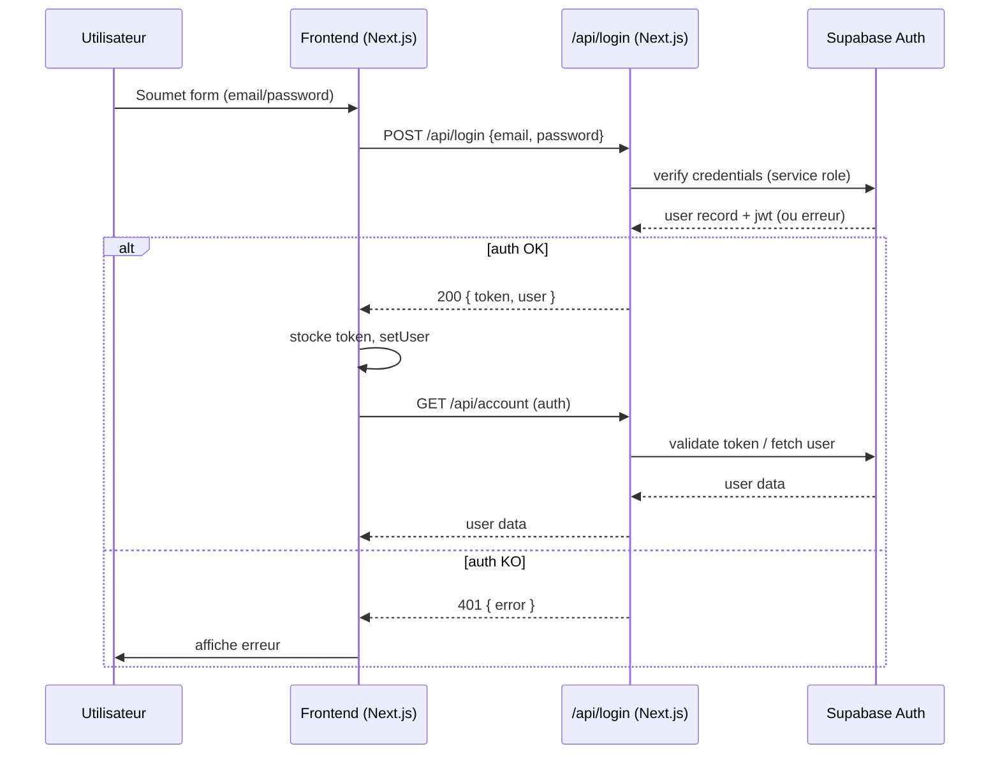
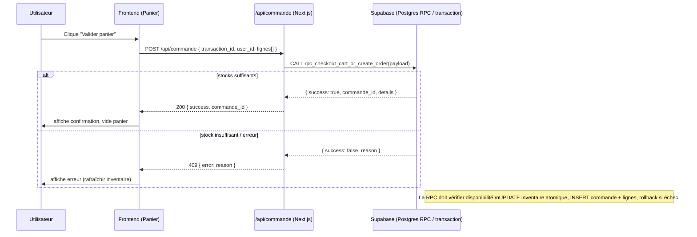
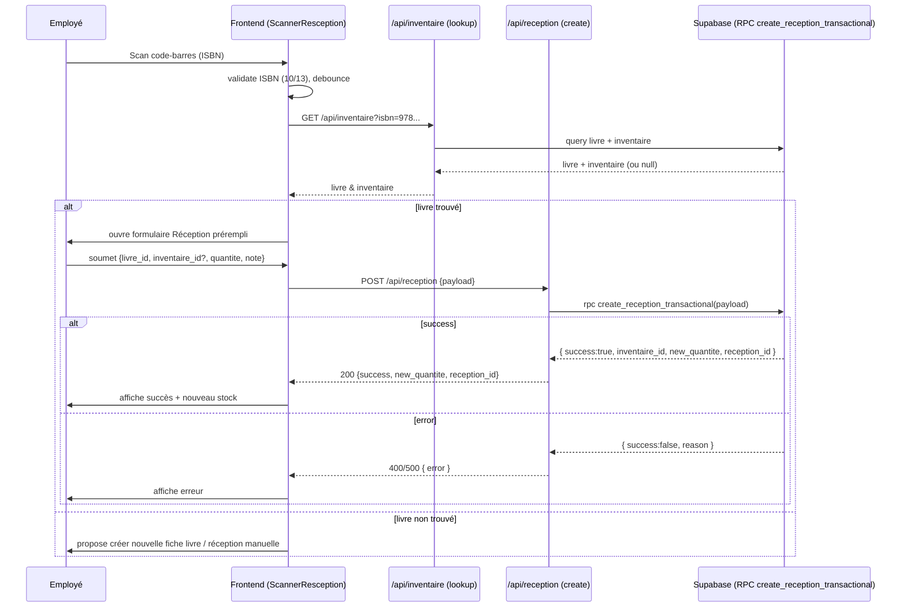

# Diagrammes de séquence — CPH France IOI

Fichier contenant 3 diagrammes de séquence haut‑niveau pour les cas d'utilisation critiques : connexion, validation du panier (checkout) et réception via scanner. Coller le contenu dans un visualiseur Mermaid (mermaid.live ou extension VSCode) pour exporter en PNG/SVG.

## 1) Connexion (Login)

## 2) Checkout (panier → commande, transaction atomique)

## 3) Réception via scanner (scan ISBN → lookup → create reception)
